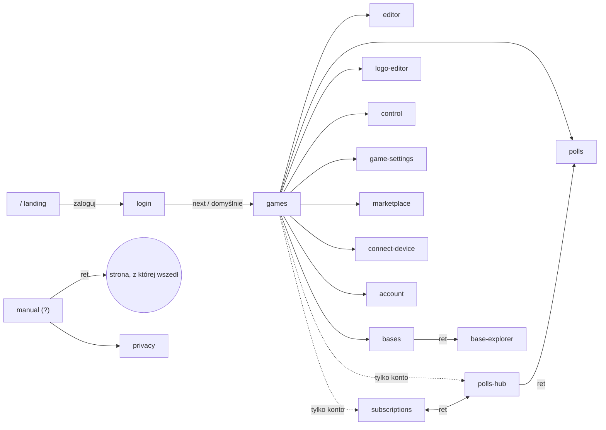

# Nawigacja — jedna mapa przekierowań (propozycja)

Cel: każda strona deklaruje w JEDNYM miejscu kto może na nią wejść
(niezalogowany / gość / konto), na jakim urządzeniu, dokąd prowadzi „Wstecz”
i jak się nazywa. Strony przestają same składać `?ret=`, `?from=`, etykiety
„← Wróć do …”, overlaye gościa i przekierowania na logowanie.

---

## 1. Co dziś jest niespójne (znalezione w kodzie)

**Powrót („Wstecz”)**

| Strona | Jak dziś liczy powrót | Problem |
|---|---|---|
| games → bases / polls-hub / subscriptions / polls | `?from=games` (`games.js:1393-1610`) | nikt nie czyta `from` — strony czytają `ret`; działa tylko dzięki domyślnemu `/games/` |
| polls-hub → polls | `?ret=<bieżący url>` (`polls-hub.js:548`) | OK, ale to inny mechanizm niż wyżej |
| bases → base-explorer | bez `ret` (`bases.js:1551`), explorer zawsze wraca na `/bases/` (`page.js:53`) | gubi zakładkę/filtr bases |
| editor, logo-editor, control, game-settings | na sztywno `/games/` | wejście z innego miejsca i tak wraca do gier; część bez `withLangParam` (`control/app.js:810`, `game-settings.js:1618`) — gubi język |
| marketplace → manual | `ret=marketplace` (nie ścieżka!) (`marketplace.js:808`) | manual normalizuje to do `/marketplace` przypadkiem |
| device-guard „Wstecz” | `history.back()` / `document.referrer` | inaczej niż wszystkie inne przyciski |
| etykiety „← Wróć do …” | osobne tabele `ret → klucz` w `manual.js:142`, `polls-hub.js:1138`, `subscriptions.js:792` | trzy kopie tej samej logiki, każda z inną listą stron |

**Logowanie i role**

- `requireAuth()` w control jest wołane bez argumentu → domyślne `"login"` to
  ścieżka WZGLĘDNA → przekierowanie na `/control/login` (404).
  (`control/app.js:173`, `auth.js:298`). **To jest realny błąd.**
- Niezalogowany wyrzucony na `/login/` nie wraca tam, skąd przyszedł —
  `next` obsługuje tylko `polls-hub` i `subscriptions` (`login.js:559`).
  Link do `/editor/?id=…` po zalogowaniu kończy na `/games/`.
- `account` woła `requireAuth("/login/?setup=username")` — niezalogowany
  ląduje na ekranie ustawiania nazwy zamiast logowania.
- Gość: polls-hub/subscriptions pokazują overlay (`showGuestBlockedOverlay`),
  bases/games/account chowają przyciski (`hideForGuest`), marketplace
  traktuje gościa jak niezalogowanego, connect-device wysyła gościa
  „Wstecz” na `/` (landing), a marketplace na `/games/`.
- Overlay gościa i overlay urządzenia wyglądają inaczej (`guest-mode.js` vs
  `device-guard.js`).

**Topbar**

- „Ustawienia konta” w menu konta jest tylko na games (`withAccountSettings`).
- Wylogowanie ma 3 różne klucze i18n (`control.logout`,
  `logoEditor.topbar.logout`, `baseExplorer.logout`) obok `common.logout`.
- account nie ma sekcji 4 (konta), privacy nie ma „Instrukcji”,
  marketplace w sekcji 1 ma „Moje gry” zamiast „← Wstecz”.

**Mobile / desktop — trzy różne definicje „telefonu”**

| Gdzie | Reguła |
|---|---|
| topbar → hamburger | szerokość okna ≤ 980 px |
| modal-sheet (pełnoekranowe modale) | szerokość okna ≤ 600 px |
| device-guard (control, game-settings) | krótszy bok ekranu < 700 px |

---

## 2. Propozycja: `shared/js/core/nav-map.js`

Jeden deklaratywny plik. Każda strona to wpis:

```js
// shared/js/core/nav-map.js
// access:  kto wchodzi: "public" | "guest" (gość + konto) | "user" (tylko konto)
// device:  "any" | "wide" (Control/ustawienia gry: device-guard)
// parent:  dokąd „Wstecz”, gdy nie ma poprawnego ?ret=
// manual:  kotwica instrukcji (#...) dla przycisku „?”
export const PAGES = {
  home:          { path: "/",               access: "public" },
  login:         { path: "/login/",         access: "public" },
  games:         { path: "/games/",         access: "guest",  parent: null,        manual: "general" },
  editor:        { path: "/editor/",        access: "guest",  parent: "games",     manual: "editor" },
  polls:         { path: "/polls/",         access: "guest",  parent: "games",     manual: "polls" },
  pollsHub:      { path: "/polls-hub/",     access: "user",   parent: "games",     manual: "polls" },
  subscriptions: { path: "/subscriptions/", access: "user",   parent: "games",     manual: "subscriptions" },
  bases:         { path: "/bases/",         access: "guest",  parent: "games",     manual: "bases" },
  baseExplorer:  { path: "/base-explorer/", access: "guest",  parent: "bases",     manual: "bases" },
  logoEditor:    { path: "/logo-editor/",   access: "guest",  parent: "games",     manual: "logo" },
  control:       { path: "/control/",       access: "guest",  parent: "games",     manual: "control",  device: "wide" },
  gameSettings:  { path: "/game-settings/", access: "guest",  parent: "games",     manual: "control",  device: "wide" },
  marketplace:   { path: "/marketplace/",   access: "public", parent: "games",     manual: "community" },
  connectDevice: { path: "/connect-device/",access: "public", parent: "games",     manual: "connect" },
  account:       { path: "/account/",       access: "guest",  parent: "games",     manual: "general" },
  manual:        { path: "/manual/",        access: "guest",  parent: "games" },
  privacy:       { path: "/privacy/",       access: "public", parent: "manual" },
};
```

Nazwa strony do etykiet: `nav.page.<id>` w `pl/en/uk.js`, przycisk powrotu
zawsze `nav.backTo` = „Wróć do: {page}”. Koniec z tabelami etykiet.

### API (to, czego używają strony)

```js
// Jedno wywołanie na starcie strony zamiast requireAuth + showGuestBlockedOverlay
// + guardDesktopOnly + setTopbarAccount + ręcznego btnBack/btnManual:
const user = await initPage("editor");

linkTo("polls", { id })       // → /polls/?id=…&ret=<bieżący url>&lang=…
backHref("polls")             // poprawny ?ret= (ta sama domena, znana strona) albo parent
loginUrl()                    // → /login/?next=<bieżący url>
```

`initPage(id)` robi po kolei:

1. **Dostęp** wg tabeli z punktu 3 (przekierowanie / overlay / OK).
2. **Urządzenie**: `device: "wide"` → `guardDesktopOnly()`.
3. **Topbar**: podpina `#btnBack` (href + etykieta z mapy), `#btnManual`
   (`/manual/?ret=…#<manual>`), konto (`setTopbarAccount` z tym samym menu
   na każdej stronie).
4. Zwraca użytkownika (albo `null` dla `public`).

Strony z własną logiką powrotu (edytor w trybie edycji pytania, modal-sheet,
ostrzeżenie w trakcie gry w Control) dalej przechwytują klik, ale cel
bierą z `backHref()`.

---

## 3. Mapa przekierowań (role × strona)

Legenda: **OK** — wchodzi; **→ X** — przekierowanie; **[gość]** — overlay
„tylko dla konta” (Wstecz → parent, Załóż konto → login); **[urządz.]** —
overlay device-guard.

| Strona | Niezalogowany | Gość | Konto | Telefon |
|---|---|---|---|---|
| `/` landing | OK | OK *(do decyzji: → /games/)* | → `/games/` | OK |
| `/login/` | OK | OK (migracja konta) | → `next` lub `/games/` | OK |
| `/reset/` `/confirm/` | OK (token) | OK | OK | OK |
| `/games/` | → login?next | OK, bez: Ankiety, Subskrypcje, Podłącz urządzenie | OK | OK (hamburger) |
| `/editor/` `/polls/` `/bases/` `/base-explorer/` `/logo-editor/` | → login?next | OK (bases bez udostępniania) | OK | OK |
| `/polls-hub/` `/subscriptions/` | → login?next | [gość] | OK | OK |
| `/control/` `/game-settings/` | → login?next | OK | OK | [urządz.] |
| `/marketplace/` | OK (tylko przeglądanie), Wstecz → `/` | OK (bez oceniania/wysyłania), Wstecz → `/games/` | OK | OK |
| `/connect-device/` | OK, Wstecz → `/` | OK, Wstecz → `/games/` | OK + moje urządzenia | OK |
| `/account/` | → login?next | OK (tylko usuń/migruj) | OK | OK |
| `/manual/` | → login?next *(do decyzji: public)* | OK | OK | OK |
| `/privacy/` | OK | OK | OK | OK |
| `/display/` `/host/` `/buzzer/` `/poll-*` `/connect-device/tv/` | z klucza w URL, bez topbaru — poza mapą | | | |
| `/settings/` | Cloudflare Access — poza mapą | | | |

Zasada „Wstecz” dla stron `public`: parent liczony od roli —
niezalogowany wraca na `/`, gość i konto na `/games/` (jedna reguła zamiast
różnych ifów w connect-device i marketplace).



---

## 4. Topbar — jeden układ na każdej stronie

| Sekcja | Zawartość | Mobile (≤ 980 px) |
|---|---|---|
| 1 | `← Wróć do: {parent}` (z mapy) | zostaje w pasku |
| 2 | nawigacja/tytuł strony (np. przyciski hubów w games, tytuł gry) | do hamburgera |
| 3 | narzędzia strony + **„?” Instrukcja zawsze ostatnia** | hamburger tu |
| 4 | konto: `nazwa ▾` → Ustawienia konta, Wyloguj · gość: `Gość ▾` → Załóż konto, Ustawienia konta · niezalogowany: „Zaloguj / Załóż konto” | do hamburgera |

Do ujednolicenia przy okazji: jeden klucz `common.logout`, menu konta z
„Ustawieniami konta” wszędzie (nie tylko games), sekcja 4 także na account,
„?” także na privacy, w marketplace „Moje gry” → zwykłe „← Wróć do”.

---

## 5. Mobile / desktop — jedno źródło prawdy

W `device-guard.js` (lub nowym `viewport.js`) trzy nazwane progi, używane
przez wszystkie moduły zamiast liczb w kodzie:

```js
export const VIEW = {
  compactTopbar: "(max-width: 980px)", // hamburger
  sheet:         "(max-width: 600px)", // modale jako pełny ekran
};
export const isPhoneScreen = () => shortSide < 700; // blokada Control
```

Progi zostają takie jak dziś — chodzi o to, żeby były nazwane i w jednym
pliku, a CSS korzystał z tych samych wartości (komentarz przy `@media`).

---

## 6. Wdrożenie (kroki, każdy osobno do testu)

1. **Poprawki błędów od razu** (małe, niezależne od mapy):
   `requireAuth()` w control → `"/login/"`; domyślny argument w `auth.js`
   na ścieżkę bezwzględną; account → `requireAuth("/login/")`;
   `withLangParam` w twardych `/games/`.
2. `nav-map.js` + `backHref/linkTo/loginUrl` + klucze `nav.*`; podmiana
   `?from=games` na `linkTo()`; usunięcie trzech tabel etykiet.
3. `login`: ogólne `next=<ścieżka>` (walidacja: ta sama domena + strona z
   mapy), stare `next=polls-hub|subscriptions` zostaje jako alias.
4. `initPage()` strona po stronie (kolejność jak audyty), wspólny wygląd
   overlayu gość/urządzenie.
5. Test `tests/e2e/frontend-navigation.spec.js` generowany z `PAGES`:
   dla każdej strony × rola sprawdza przekierowanie / overlay / cel „Wstecz”
   i etykietę; wariant mobilny (viewport 390×844) — hamburger, overlay
   urządzenia na control/game-settings.

## 7. Do decyzji

- Gość na `/` — zostaje na landing czy od razu `/games/`?
- `/manual/` dla niezalogowanych — publiczna (pomoc przed założeniem konta)?
- Po zalogowaniu z `/` — zawsze `/games/`, czy ostatnio odwiedzona strona?
- Czy `ret` ma przechodzić łańcuchem (polls-hub → polls → manual → z powrotem
  do polls, a stamtąd do polls-hub), czy powrót tylko o jeden poziom?
