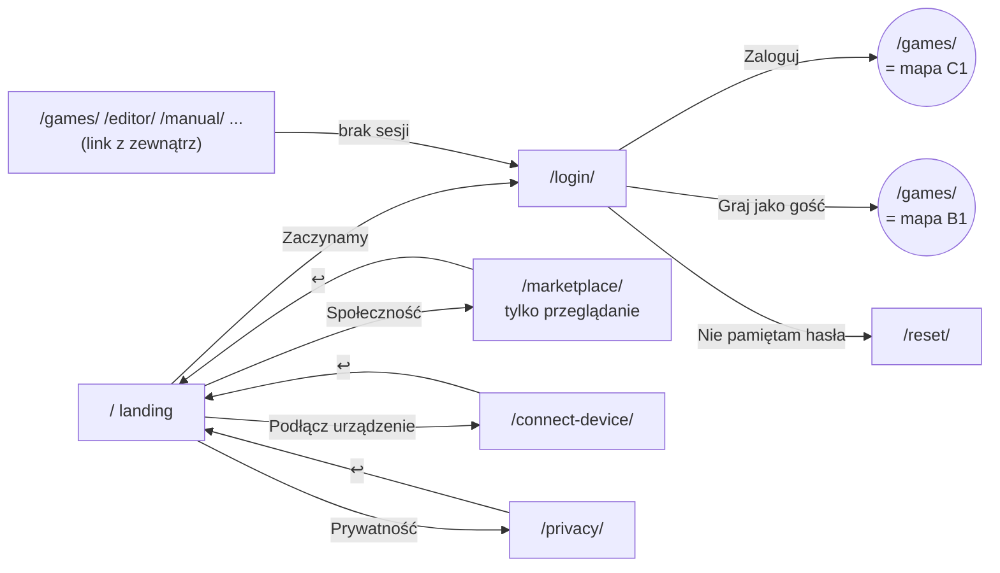
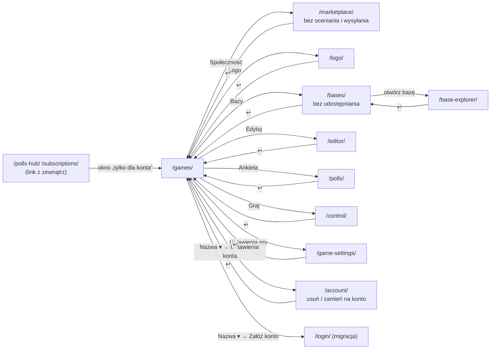
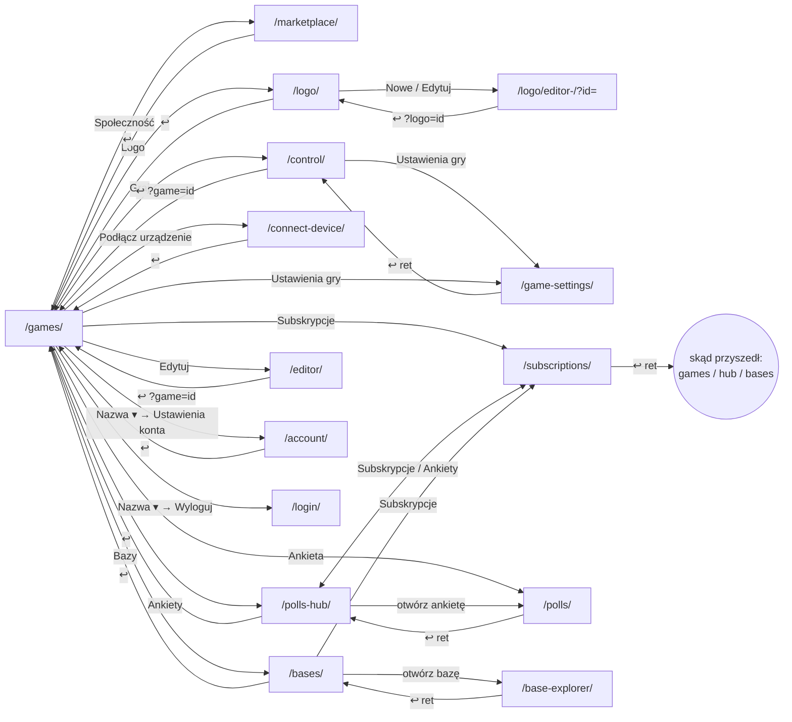

# Nawigacja — jedna mapa przekierowań (propozycja)

Cel: każda strona deklaruje w JEDNYM miejscu kto może na nią wejść
(niezalogowany / gość / konto), na jakim urządzeniu, dokąd prowadzi „Wstecz”
i jak się nazywa. Strony przestają same składać `?ret=`, `?from=`, etykiety
„← Wróć do …”, overlaye gościa i przekierowania na logowanie.

---

## 1. Co dziś jest niespójne (znalezione w kodzie)

**Powrót („Wstecz”)**

| Strona | Jak dziś liczy powrót | Problem |
|---|---|---|
| games → bases / polls-hub / subscriptions / polls | `?from=games` (`games.js:1393-1610`) | nikt nie czyta `from` — strony czytają `ret`; działa tylko dzięki domyślnemu `/games/` |
| polls-hub → polls | `?ret=<bieżący url>` (`polls-hub.js:548`) | OK, ale to inny mechanizm niż wyżej |
| bases → base-explorer | bez `ret` (`bases.js:1551`), explorer zawsze wraca na `/bases/` (`page.js:53`) | gubi zakładkę/filtr bases |
| editor, logo-editor, control, game-settings | na sztywno `/games/` | wejście z innego miejsca i tak wraca do gier; część bez `withLangParam` (`control/app.js:810`, `game-settings.js:1618`) — gubi język |
| marketplace → manual | `ret=marketplace` (nie ścieżka!) (`marketplace.js:808`) | manual normalizuje to do `/marketplace` przypadkiem |
| device-guard „Wstecz” | `history.back()` / `document.referrer` | inaczej niż wszystkie inne przyciski |
| etykiety „← Wróć do …” | osobne tabele `ret → klucz` w `manual.js:142`, `polls-hub.js:1138`, `subscriptions.js:792` | trzy kopie tej samej logiki, każda z inną listą stron |

**Logowanie i role**

- `requireAuth()` w control jest wołane bez argumentu → domyślne `"login"` to
  ścieżka WZGLĘDNA → przekierowanie na `/control/login` (404).
  (`control/app.js:173`, `auth.js:298`). **To jest realny błąd.**
- Po zalogowaniu zawsze `/games/` — **tak ma zostać** (decyzja). Jedyny
  wyjątek już istnieje: zaproszenie z maila (`/poll-go/` →
  `/login/?next=polls-hub|subscriptions`, `login.js:559`), który po
  zalogowaniu otwiera to zadanie/subskrypcję.
- `account` woła `requireAuth("/login/?setup=username")` — niezalogowany
  ląduje na ekranie ustawiania nazwy zamiast logowania.
- Gość: polls-hub/subscriptions pokazują overlay (`showGuestBlockedOverlay`),
  bases/games/account chowają przyciski (`hideForGuest`), marketplace
  traktuje gościa jak niezalogowanego, connect-device wysyła gościa
  „Wstecz” na `/` (landing), a marketplace na `/games/`.
- Overlay gościa i overlay urządzenia wyglądają inaczej (`guest-mode.js` vs
  `device-guard.js`).

**Topbar**

- „Ustawienia konta” w menu konta jest tylko na games (`withAccountSettings`).
- Wylogowanie ma 3 różne klucze i18n (`control.logout`,
  `logoEditor.topbar.logout`, `baseExplorer.logout`) obok `common.logout`.
- account nie ma sekcji 4 (konta), privacy nie ma „Instrukcji”,
  marketplace w sekcji 1 ma „Moje gry” zamiast „← Wstecz”.

**Mobile / desktop — trzy różne definicje „telefonu”**

| Gdzie | Reguła |
|---|---|
| topbar → hamburger | szerokość okna ≤ 980 px |
| modal-sheet (pełnoekranowe modale) | szerokość okna ≤ 600 px |
| device-guard (control, game-settings) | krótszy bok ekranu < 700 px |

**Tryb modala (strona w `iframe` na innej stronie)** — kierunek: rezygnacja, patrz sekcja 2 „Bez stron modalnych”.

| Strona w modalu | Kto otwiera | Parametr | Problem |
|---|---|---|---|
| `/game-settings/` | Control (`control/app.js:767`) | `modal=1` | inny format niż reszta; zamykanie własnym protokołem `gs:requestClose / gs:close / gs:ready` |
| `/manual/` | Control, game-settings, logo-editor (tylko w trybie edycji) | `modal=control` / `modal=logo-editor` | każda strona ma WŁASNĄ kopię okna pomocy (HTML + JS) — 3 kopie |
| `/privacy/` | te same trzy | `modal=control` / `modal=logo-editor` | w `<head>` chowa topbar dla każdej wartości, ale `privacy.js:51` rozpoznaje tylko `control` → w logo-editorze inny układ |

- Modal w modalu: Control → ustawienia gry (iframe) → „?” → instrukcja
  (iframe w iframe).
- `ret` w modalu jest bez sensu, a bywa zepsuty: game-settings ustawia
  `ret=game-settings?...` (bez `/`, `game-settings.js:1831`).
- Strona w modalu przy braku sesji przekierowuje **sam iframe** na
  `/login/` (game-settings woła `requireAuth`) — logowanie w okienku.
- Ta sama strona otwierana raz jako modal, raz jako zwykła strona: w
  logo-editorze „?” na liście = przejście na `/manual/`, w trybie edycji =
  modal; w game-settings „?” = zawsze modal.

---

## 2. Propozycja: `shared/js/core/nav-map.js`

Jeden deklaratywny plik. Każda strona to wpis:

```js
// shared/js/core/nav-map.js
// access:  kto wchodzi: "public" | "guest" (gość + konto) | "user" (tylko konto)
// device:  "any" | "wide" (Control/ustawienia gry: device-guard)
// parent:  dokąd „Wstecz”, gdy nie ma poprawnego ?ret=
// from:    strony, na które „Wstecz” wolno wrócić (dozwolona ścieżka) — ?ret=
//          spoza tej listy jest ignorowane i „Wstecz” idzie do parent
// manual:  kotwica instrukcji (#...) dla przycisku „?”
export const PAGES = {
  home:          { path: "/",               access: "public" },
  login:         { path: "/login/",         access: "public" },
  games:         { path: "/games/",         access: "guest",  parent: null,        manual: "general" },
  editor:        { path: "/editor/",        access: "guest",  parent: "games",     manual: "editor" },
  polls:         { path: "/polls/",         access: "guest",  parent: "games",     manual: "polls" },
  pollsHub:      { path: "/polls-hub/",     access: "user",   parent: "games",     manual: "polls" },
  subscriptions: { path: "/subscriptions/", access: "user",   parent: "games",     manual: "subscriptions" },
  bases:         { path: "/bases/",         access: "guest",  parent: "games",     manual: "bases" },
  baseExplorer:  { path: "/base-explorer/", access: "guest",  parent: "bases",     manual: "bases" },
  logoEditor:    { path: "/logo/",   access: "guest",  parent: "games",     manual: "logo" },
  control:       { path: "/control/",       access: "guest",  parent: "games",     manual: "control",  device: "wide" },
  gameSettings:  { path: "/game-settings/", access: "guest",  parent: "games",     manual: "control",  device: "wide" },
  marketplace:   { path: "/marketplace/",   access: "public", parent: "games",     manual: "community" },
  connectDevice: { path: "/connect-device/",access: "public", parent: "games",     manual: "connect" },
  account:       { path: "/account/",       access: "guest",  parent: "games",     manual: "general" },
  manual:        { path: "/manual/",        access: "guest",  parent: "games" },  // decyzja: tylko z kontem/gościem
  privacy:       { path: "/privacy/",       access: "public", parent: "manual" },
};
```

Nazwa strony do etykiet: `nav.page.<id>` w `pl/en/uk.js`, przycisk powrotu
zawsze `nav.backTo` = „Wróć do: {page}”. Koniec z tabelami etykiet.

### API (to, czego używają strony)

```js
// Jedno wywołanie na starcie strony zamiast requireAuth + showGuestBlockedOverlay
// + guardDesktopOnly + setTopbarAccount + ręcznego btnBack/btnManual:
const user = await initPage("editor");

linkTo("polls", { id })       // → /polls/?id=…&ret=<bieżący url>&lang=…
backHref("polls")             // ?ret=, jeśli to dozwolona ścieżka (from), inaczej parent
loginUrl()                    // → /login/ (po zalogowaniu zawsze /games/)
```

`initPage(id)` robi po kolei:

1. **Dostęp** wg tabeli z punktu 3 (przekierowanie / overlay / OK).
2. **Urządzenie**: `device: "wide"` → `guardDesktopOnly()`.
3. **Topbar**: podpina `#btnBack` (href + etykieta z mapy), `#btnManual`
   (`/manual/?ret=…#<manual>`), konto (`setTopbarAccount` z tym samym menu
   na każdej stronie).
4. Zwraca użytkownika (albo `null` dla `public`).

### „Wstecz” przez wszystkie kroki, tylko po dozwolonej ścieżce (decyzja)

`linkTo()` zapisuje w `ret` **pełny** bieżący adres — razem z jego własnym
`ret`. Dzięki temu łańcuch odtwarza się sam, krok po kroku:

```
/games/
  → /polls-hub/?ret=/games/
    → /polls/?id=7&ret=/polls-hub/?ret=/games/
      → /manual/?ret=/polls/?id=7&ret=/polls-hub/?ret=/games/#polls
↩ manual → polls(7) → polls-hub → games
```

Każdy krok jest sprawdzany z mapą: `ret` musi wskazywać stronę z listy
`from` bieżącej strony (np. `polls.from = ["games", "pollsHub"]`,
`manual.from = *` — wszystkie strony z topbarem). Inny / obcy / zepsuty
`ret` → „Wstecz” do `parent`. Podwójnych powrotów będzie mało, ale gdyby
łańcuch urósł, limit 4 poziomów (głębsze `ret` są obcinane do `parent`).

### Bez stron modalnych (kierunek)

Każda strona jest zwykłą stroną: `?`, „Prywatność” i ustawienia gry zawsze
**przechodzą** (z `ret`), nigdy nie otwierają się w `iframe`. Tryb
`?modal=` znika z manual, privacy i game-settings, a z nim 3 kopie okna
pomocy i protokół `gs:*`. Okna (modal-sheet) zostają tylko dla dialogów
wewnątrz strony (potwierdzenia, podgląd, formularze) — to nie są strony.

Warunek: **wyjście ze strony nigdy nie gubi pracy.** Dlatego najpierw:

| Strona | Dziś | Potrzebne |
|---|---|---|
| `/editor/` (pytania) | autozapis już jest (`debounce` + `flush` przy wyjściu, `editor.js:101`) | nic — to jest wzór |
| `/logo-editor/` tryb edycji | ręczne „Zapisz”, pytanie przy zamykaniu, `beforeunload` (`main.js:531-584`) | **autozapis + żywy postęp** (niżej) |
| `/game-settings/` | „Zapisz wszystko”, pytanie o niezapisane zmiany (`game-settings.js:173`) | autozapis jak w edytorze pytań |
| `/control/` | stan gry w bazie, `store.hydrate()` wznawia po powrocie (`store.js:78`) | nic — powrót z instrukcji/ustawień odtwarza stan |

**Autozapis bez pytania (logo, ustawienia gry)** — ten sam wzorzec co
`editor.js`. Postęp jest cały czas zapisany, więc nie ma pytania „Masz
niezapisane zmiany” w ogóle, a do pracy można wrócić nawet po zamknięciu
karty:
1. Każda zmiana → zapis z opóźnieniem (`debounce` ~800 ms; rysowanie:
   po puszczeniu pędzla, nie co piksel).
2. `flush()` przy wyjściu: klik „Wstecz”/„?”, `pagehide`,
   `visibilitychange: hidden`. Bez `beforeunload` i bez pytań.
3. Żywy status w miejscu przycisku „Zapisz”: *Zapisywanie… → Zapisano ✓ →
   Błąd zapisu (ponawiam…)*. Błąd też nie pyta — zmiany czekają w kopii
   roboczej i idą przy następnej próbie / następnym otwarciu.
4. Kopia robocza w `localStorage` pod kluczem `logo:<id>` (to, czego baza
   jeszcze nie ma); po ponownym otwarciu `?id=` — dosłana do bazy i
   usunięta.
5. Nowe logo: wiersz w bazie powstaje od razu po „Nowe logo” (nazwa
   domyślna jak dziś, `defaultName()`), żeby `id` było w adresie od
   pierwszej chwili.
6. Cofnij/ponów w rysowaniu (`draw.js` `history`) — może iść do tej samej
   kopii roboczej, wtedy działa też po powrocie.

**Podział edytorów na osobne strony** (koniec z ✕ w topbarze i trybem
„edycja” wewnątrz listy):

| Dziś | Po podziale | ↩ |
|---|---|---|
| `/logo-editor/` lista + tryb edycji (`is-editor`, `topbar-no-menu`, `btnCloseEditor` ✕) | `/logo/` — tylko lista · **3 osobne strony** jak edytor pytań: `/logo/editor-text/?id=…`, `/logo/editor-draw/?id=…`, `/logo/editor-image/?id=…` | „← Wróć do: Logo” → `/logo/?logo=<id>` |
| Control → ustawienia gry w `iframe` | `/game-settings/?id=…&ret=/control/?id=…` | „← Wróć do: Control” |
| Control / game-settings / logo-editor → instrukcja, prywatność w `iframe` | `/manual/?ret=…`, `/privacy/?ret=…` | „← Wróć do: {strona}” |
| `/editor/` — wybrane pytanie tylko w pamięci (`activeQId`, `editor.js:362`) | `/editor/?id=<gra>&q=<pytanie>` — po powrocie (z instrukcji, odświeżeniu, linku) otwiera się to samo pytanie | telefon: ↩ zamyka pytanie (`?q=` znika z adresu); bez pytania: ↩ → `/games/?game=<id>` |

**Adresy (decyzja):** lista `/logo/`, edytory `/logo/editor-text/`,
`/logo/editor-draw/`, `/logo/editor-image/` (`?id=<logo>`); w mapie skrótowo `/logo/editor-<typ>/`. Stary
`/logo-editor/` zostaje jako przekierowanie na `/logo/` (zakładki, cache,
linki w instrukcji); `?tab=` przenoszone.

W mapie trzy wpisy `logoText`, `logoDraw`, `logoImage` (`access: "guest"`,
`parent: "logoEditor"`, `device: "noPhone"`, `resource: "logo"`) — na
telefonie „Edytuj” i „Nowe logo” są ukryte (ta sama reguła co „Graj”).
Strona sprawdza typ logo z `?id=`: logo rysowane otwarte pod `/text/` →
przekierowanie na `/draw/?id=…` (ten sam `ret`). Edytor logo staje się
4 lekkimi stronami zamiast jednej 871-liniowej `main.js` z trzema trybami:
wspólny kod (zapis, kopia robocza, podgląd, topbar) w module, każda strona
ładuje tylko swój edytor (`text.js` / `draw.js` / `image.js`).

### Mapa pamięta konkretną grę / logo (zasoby)

Powrót nie prowadzi „na listę”, tylko do **tej samej gry / logo / bazy** —
zaznaczonej, z właściwą zakładką. Mapa rozszerza się o zasób:

| Zasób | Strony szczegółu (`?id=`) | Lista zaznacza (`?<zasób>=`) |
|---|---|---|
| gra | `/editor/` (+ `&q=<pytanie>`), `/polls/`, `/control/`, `/game-settings/` | `/games/?game=<id>` (zakładka z typu gry), `/polls-hub/?game=<id>` |
| logo | `/logo/editor-<typ>/` | `/logo/?logo=<id>` (zakładka z typu logo) |
| baza | `/base-explorer/?id=<id>&folder=…` (dziś `?base=`, zostaje jako alias) | `/bases/?base=<id>` |

```js
editor:       { path: "/editor/",       resource: "game", parent: "games",      state: ["id", "q"] },
control:      { path: "/control/",      resource: "game", parent: "games",      state: ["id"] },
gameSettings: { path: "/game-settings/",resource: "game", parent: "control",    state: ["id"] },
logoDraw:     { path: "/logo/editor-draw/", resource: "logo", parent: "logoEditor", state: ["id"] },
games:        { path: "/games/",        select: "game",   state: ["game", "tab"] },
logoEditor:   { path: "/logo/",  select: "logo",   state: ["logo", "tab"] },
```

- `backHref()` bez `ret`: `parent` + zasób bieżącej strony →
  z `/control/?id=7` ↩ `/games/?game=7`; z `/logo/editor-draw/?id=3` ↩
  `/logo/?logo=3`.
- `parent` też z zasobem: `gameSettings.parent = "control"` — bez `ret`
  ↩ prowadzi do Control tej gry (na telefonie, gdzie Control jest
  zablokowany, do `/games/?game=<id>`).
- Gra/logo usunięte w międzyczasie → lista bez zaznaczenia, bez błędu.
- `state` to jedyne parametry zapisywane w `ret` — reszta adresu (tokeny
  `t`, `s`, `share`, otwarte okna) nie wchodzi do powrotu.

### Okna na telefonie — powrót zawsze do strony podstawowej (decyzja)

Na telefonie dialogi (modal-sheet ≤ 600 px) zajmują cały ekran, ale **nie
są stanem strony**: nie ma ich w adresie ani w `ret`. Wyjście z okna na
inną stronę (np. `?` z podglądu gry) i powrót ↩ → strona podstawowa
z zaznaczonym zasobem (`/games/?game=7`), okno się **nie** otwiera
ponownie. Granica: stan strony (`id`, `q`, `tab`, `folder`, zaznaczenie)
jest w adresie i wraca; okna nie.

**Control w trakcie gry** — wyjście do instrukcji jest bezpieczne
(stan w bazie, urządzenia dalej wyświetlają), ale operator traci widok
pulpitu. Propozycja: w trakcie gry `?` otwiera instrukcję w nowej karcie
(`target=_blank`), przed grą — zwykłe przejście. Do decyzji.

**Przejściowo** (do czasu kroków z sekcji 6) obecne `?modal=` działa dalej;
nie dokładamy nowych stron modalnych i nie ujednolicamy starych — idą do
usunięcia. Stare linki z `?modal=` (cache, zakładki) → ta sama strona bez
trybu modala.

Strony z własną logiką powrotu (edytor w trybie edycji pytania, modal-sheet,
ostrzeżenie w trakcie gry w Control) dalej przechwytują klik, ale cel
bierą z `backHref()`.

---

## 3. Sześć map: 3 role × 2 urządzenia

Każda mapa to osobny, kompletny obraz tego, co widzi dana osoba: od czego
zaczyna, jakie ma przyciski na każdej stronie i dokąd one prowadzą. Mapy
odpowiadają 1:1 wpisom w `nav-map.js` — kod i test e2e czytają te same dane.

|  | Desktop (> 980 px) | Mobile (≤ 980 px, telefon = krótszy bok < 700 px) |
|---|---|---|
| **Niezalogowany** | Mapa A1 | Mapa A2 |
| **Gość** | Mapa B1 | Mapa B2 |
| **Zalogowany** | Mapa C1 | Mapa C2 |

Oznaczenia w mapach: `→` przejście, `↩` przycisk „Wstecz” (sekcja 1 topbaru),
`?` instrukcja (zawsze wraca tam, skąd weszła), `☰` hamburger,
**⚠ dziś** — jak działa teraz, jeśli inaczej niż w mapie.

Wspólne dla wszystkich map (nie powtarzam w każdej):
- `?` → `/manual/?ret=<bieżąca>#<sekcja>` → `↩` wraca na bieżącą;
  w instrukcji „Prywatność” → `/privacy/` → `↩` do instrukcji.
- **Bez stron modalnych** (sekcja 2): `?`, „Prywatność” i ustawienia gry
  to zawsze przejście z `ret`. Edytor logo to osobna strona
  `/logo/editor-<typ>/`. Nigdzie nie ma ✕ w topbarze — tylko ↩.
- Strony urządzeń (`/display/`, `/host/`, `/buzzer/`, `/poll-*`,
  `/connect-device/tv/`) otwierane z klucza w adresie — bez topbaru,
  bez ról, poza mapami.
- `/reset/` i `/confirm/` — z linku w mailu, po sukcesie → `/login/` /
  `/games/`.

---

### Mapa A1 — Niezalogowany, desktop

Start: `/` (landing). Wszystko poza stronami publicznymi → `/login/`.
Logowanie tylko na `/login/` (landing ma tylko przycisk „Zaczynamy”).



| Strona | Przyciski | Cel |
|---|---|---|
| `/` | Zaczynamy · Społeczność · Podłącz urządzenie · Prywatność | login · marketplace · connect-device · privacy |
| `/login/` | Zaloguj / Zarejestruj · Graj jako gość · Nie pamiętam hasła | `/games/` (wyjątek: zaproszenie z maila) · `/games/` · reset |
| `/marketplace/` | ↩ „Strona główna” · podgląd gier · topbar: „Zaloguj / Załóż konto” | `/` · — · `/login/` |
| `/privacy/` | ↩ „Strona główna” | `/` |
| `/connect-device/` | ↩ · skan QR / kod | `/` · strona urządzenia |
| każda inna (w tym `/manual/`) | — | `/login/` |

**⚠ dziś:** `/control/` bez sesji → `/control/login` (404); `/account/`
bez sesji → ekran ustawiania nazwy; w marketplace przycisk w sekcji 1 to
„Moje gry”.

### Mapa A2 — Niezalogowany, mobile

Te same strony i cele co A1. Różnice:

| Gdzie | Desktop | Mobile |
|---|---|---|
| topbar marketplace / connect-device / privacy | ↩ · `?` · „Zaloguj / Załóż konto” w pasku | ↩ w pasku, reszta w `☰` |
| modale (podgląd gry w marketplace) | okno | pełny ekran (≤ 600 px), ↩ zamyka modal zamiast wychodzić ze strony |
| connect-device | kod ręcznie, kamera rzadko | skan QR kamerą jako główna akcja |

---

### Mapa B1 — Gość, desktop

Start: `/games/` (po „Graj jako gość”). Konto gościa to prawie pełne konto:
ma swoje gry, bazy, logo, ankiety i grę, bez funkcji społecznościowych
i współdzielenia. Gość wchodzący na `/` lub `/login/` → od razu `/games/`
(tak samo jak zalogowany; na `/login/` zostaje tylko z `force_auth=1`, czyli
gdy sam kliknął „Załóż konto”).



| Strona | Widoczne przyciski | Ukryte dla gościa |
|---|---|---|
| `/games/` | Społeczność · Logo · Bazy · `?` · Nazwa ▾ (Ustawienia konta, Załóż konto) | Ankiety · Subskrypcje · Podłącz urządzenie |
| `/bases/` | ↩ Gry · moje bazy | zakładka „Udostępnione” · Udostępnij · Subskrypcje |
| `/marketplace/` | ↩ Gry · przeglądanie · podgląd | Oceń · Moje wysłane |
| `/account/` | ↩ Gry · Zamień na konto · Usuń | nazwa, e-mail, hasło, powiadomienia, ocena, demo |
| `/connect-device/` | ↩ Gry | moje urządzenia |
| `/control/` `/game-settings/` `/logo/` `/logo/editor-<typ>/` | jak w C1 | — |
| `/polls-hub/` `/subscriptions/` | okno „Tylko dla konta”: Wstecz → `/games/`, Załóż konto → `/login/?force_auth=1` | — |

**⚠ dziś:** „Ustawienia konta” w menu tylko na `/games/`; connect-device ↩
prowadzi gościa na `/` (landing) zamiast na `/games/`; okno „tylko dla konta”
wygląda inaczej niż okno blokady urządzenia; gość na `/` zostaje na landingu
(`home/js/index.js:10`).

### Mapa B2 — Gość, mobile

Te same strony co B1. Różnice:

| Gdzie | Desktop | Mobile |
|---|---|---|
| topbar `/games/` | przyciski w pasku, nadmiar w „Więcej ▾” | wszystko w `☰` (licznik na `☰`) |
| „Graj”, „Ustawienia gry” | → control / game-settings | **telefon:** ukryte (decyzja); **tablet w pionie:** widoczne, po wejściu okno „Obróć tablet” |
| `/logo/` | lista + edycja | telefon: tylko lista (podgląd, import/eksport, nazwa) |
| `/editor/` | lista pytań + edycja obok | edycja pytania na pełnym ekranie, ↩ najpierw zamyka pytanie |
| modale | okno | pełny ekran, ↩ zamyka modal |
| `/logo/` | Nowe logo · Edytuj | telefon: ukryte (tylko lista: podgląd, import/eksport, nazwa) |
| `/games/` | — | „Zainstaluj” (PWA), jeśli nie jest zainstalowana |

**⚠ dziś:** na telefonie „Graj” i „Ustawienia gry” prowadzą na stronę,
która od razu pokazuje blokadę — w mapie są na telefonie ukryte. Blokada
urządzenia na `/control/` i `/game-settings/` zostaje jako zabezpieczenie
(link wklejony ręcznie, zakładka).

---

### Mapa C1 — Zalogowany, desktop

Start: `/games/`; wejście na `/` lub `/login/` z sesją → `/games/`.



| Strona | ↩ prowadzi do | Pozostałe przyciski → cel |
|---|---|---|
| `/games/` | — (strona główna) | Społeczność, Logo, Podłącz urządzenie, Ankiety, Subskrypcje, Bazy, `?`, Nazwa ▾; na kafelku: Podgląd, Edytuj, Graj, Ustawienia, Ankieta |
| `/polls-hub/` | `ret` / Gry | Subskrypcje → `/subscriptions/?ret=…`; ankieta → `/polls/?id=…&ret=…`; zadanie → `/poll-*/?t=…` |
| `/subscriptions/` | `ret` / Gry | Ankiety → `/polls-hub/?ret=…` |
| `/polls/` | `ret` / Gry | — |
| `/bases/` | `ret` / Gry | Subskrypcje → `/subscriptions/?ret=…`; baza → `/base-explorer/?id=…&ret=…` |
| `/base-explorer/` | `ret` / Bazy | — |
| `/editor/?id=G&q=Q` | `ret` / `/games/?game=G` | — |
| `/marketplace/`, `/connect-device/`, `/account/` | `ret` / Gry | — |
| `/control/?id=G` | `/games/?game=G` (z ostrzeżeniem w trakcie gry) | Ustawienia gry → `/game-settings/?id=…&ret=<control>` · `?` → `/manual/?ret=<control>` |
| `/game-settings/?id=G` | `ret` / Control tej gry | Graj → `/control/?id=…` (ukryte, gdy `ret` to Control — ↩ robi to samo) · `?` |
| `/logo/?logo=L` | Gry | Nowe logo → utworzenie + `/logo/editor-<typ>/?id=…`; Edytuj → `/logo/editor-<typ>/?id=L` · `?` |
| `/logo/editor-<typ>/?id=L` | `/logo/?logo=L` (autozapis przed wyjściem, bez pytań) | `?` → `/manual/?ret=<edytor>#logo` |

**⚠ dziś:** z `/games/` wychodzi `?from=games`, którego nikt nie czyta;
bases → base-explorer bez `ret` (powrót gubi zakładkę); editor, logo-editor,
control, game-settings zawsze wracają na `/games/`, część bez języka.

### Mapa C2 — Zalogowany, mobile

Te same strony co C1. Różnice:

| Gdzie | Desktop | Mobile |
|---|---|---|
| topbar `/games/` | 6 przycisków w pasku + „Więcej ▾” | wszystko w `☰`, liczniki zsumowane na `☰` |
| topbar pozostałych stron | ↩ · sekcja 2 · `?` · Nazwa ▾ | ↩ w pasku; sekcja 2, `?`, konto płasko w `☰` |
| „Graj”, „Ustawienia gry” | → control / game-settings | **telefon:** ukryte; **tablet w pionie:** „Obróć tablet”; **wąskie okno komputera:** „Poszerz okno” |
| `/connect-device/` | kod ręcznie, kamera rzadko | skan QR kamerą jako główna akcja |
| `/logo/`, `/editor/`, modale | jak w B2 | jak w B2 |
| `/control/` (tablet) | — | operator na tablecie w poziomie |

---

### Jak z tego zrobić jedno źródło prawdy

Sześć map to sześć „widoków” tej samej tabeli `PAGES` z `nav-map.js`,
rozszerzonej o przyciski:

```js
games: {
  path: "/games/", access: "guest", parent: null,
  buttons: {
    marketplace:   { to: "marketplace" },
    logoEditor:    { to: "logoEditor" },
    connectDevice: { to: "connectDevice", roles: ["user"] },
    pollsHub:      { to: "pollsHub",      roles: ["user"] },
    subscriptions: { to: "subscriptions", roles: ["user"] },
    bases:         { to: "bases" },
    play:          { to: "control",       device: "wide" },  // telefon: ukryty
    settings:      { to: "gameSettings",  device: "wide" },  // telefon: ukryty
  },
},
```

- `initPage()` chowa/blokuje przyciski wg `roles` i `device`, podpina cele
  przez `linkTo()` (z `ret` i językiem).
- Skrypt `scripts/nav-maps.mjs` generuje z `PAGES` sześć diagramów
  (mermaid) do tego dokumentu — mapy nie rozjadą się z kodem.
- Test `frontend-navigation.spec.js` przechodzi każdą z 6 map: dla roli
  i viewportu (1280×800 / 390×844) klika każdy przycisk i sprawdza cel
  oraz ↩.


---

## 4. Topbar — jeden układ na każdej stronie

| Sekcja | Zawartość | Mobile (≤ 980 px) |
|---|---|---|
| 1 | `← Wróć do: {parent}` (z mapy) | zostaje w pasku |
| 2 | nawigacja/tytuł strony (np. przyciski hubów w games, tytuł gry) | do hamburgera |
| 3 | narzędzia strony + **„?” Instrukcja zawsze ostatnia** | hamburger tu |
| 4 | konto: `nazwa ▾` → Ustawienia konta, Wyloguj · gość: `Gość ▾` → Załóż konto, Ustawienia konta · niezalogowany: „Zaloguj / Załóż konto” | do hamburgera |

Do ujednolicenia przy okazji: jeden klucz `common.logout`, menu konta z
„Ustawieniami konta” wszędzie (nie tylko games), sekcja 4 także na account,
„?” także na privacy, w marketplace „Moje gry” → zwykłe „← Wróć do”.

---

## 5. Mobile / desktop — jedno źródło prawdy

W `device-guard.js` (lub nowym `viewport.js`) trzy nazwane progi, używane
przez wszystkie moduły zamiast liczb w kodzie:

```js
export const VIEW = {
  compactTopbar: "(max-width: 980px)", // hamburger
  sheet:         "(max-width: 600px)", // modale jako pełny ekran
};
export const isPhoneScreen = () => shortSide < 700; // blokada Control
```

Progi zostają takie jak dziś — chodzi o to, żeby były nazwane i w jednym
pliku, a CSS korzystał z tych samych wartości (komentarz przy `@media`).

---

## 6. Wdrożenie (kroki, każdy osobno do testu)

1. **Poprawki błędów od razu** (małe, niezależne od mapy):
   `requireAuth()` w control → `"/login/"`; domyślny argument w `auth.js`
   na ścieżkę bezwzględną; account → `requireAuth("/login/")`;
   `withLangParam` w twardych `/games/`.
2. `nav-map.js` + `backHref/linkTo/loginUrl` + klucze `nav.*`; podmiana
   `?from=games` na `linkTo()`; usunięcie trzech tabel etykiet.
3. Gość na `/` → `/games/`; `login` bez zmian w celu (zawsze `/games/`,
   wyjątek zaproszeń z maila zostaje); `ret` łańcuchem z listą `from`.
4. `initPage()` strona po stronie (kolejność jak audyty), wspólny wygląd
   overlayu gość/urządzenie.
5. Rezygnacja ze stron modalnych (każdy punkt osobno):
   a) refaktor edytora logo: wspólny moduł zapisu (autozapis, kopia
      robocza, status) + 3 strony `/logo/editor-<typ>/?id=`,
      lista tylko listą, usunięcie ✕, `topbar-no-menu` i okien pomocy,
   b) `/editor/?id=&q=` — pytanie w adresie,
   c) autozapis w game-settings, Control → zwykłe przejście do ustawień,
      usunięcie `gs:*`,
   d) usunięcie `?modal=` z manual i privacy (stare linki → zwykła strona).
6. Zasoby w mapie: `?game=` / `?logo=` / `?base=` na listach,
   `state` w `ret`, powrót do konkretnej gry/logo.
7. Przyciski w `PAGES` (role/urządzenie), generator diagramów 6 map,
   test e2e przechodzący 6 map (patrz koniec sekcji 3).

## 7. Decyzje

Podjęte (2026-10-07):
- **Gość na `/`** → od razu `/games/` — konto gościa to prawie pełne konto.
- **`/manual/`** — tylko z kontem/gościem. Publiczna jest tylko polityka
  prywatności (oraz landing, login, Społeczność, podłączanie urządzenia).
- **Po zalogowaniu** zawsze `/games/`. Logowanie tylko na `/login/`.
  Wyjątek, który już działa: zaproszenie z maila do ankiety/subskrypcji.
- **„Wstecz”** wraca przez wszystkie kroki, ale tylko po dozwolonej ścieżce
  (lista `from` w mapie); podwójnych powrotów będzie mało.
- **Telefon**: „Graj” i „Ustawienia gry” są ukryte (przycisk z
  `device: "wide"` znika, gdy `isPhoneScreen()`; tablet je widzi). Blokada
  urządzenia na samych stronach zostaje jako zabezpieczenie.
- **Bez stron modalnych** (kierunek): `?`, prywatność i ustawienia gry to
  zwykłe przejścia; edytor logo osobną stroną z autozapisem; bez ✕
  w topbarze. Większa zmiana — robiona etapami (sekcja 6, krok 5).
- **Edytor logo**: refaktor na 3 osobne strony (tekst / rysunek / obraz)
  otwierane jak edytor pytań, `id` logo w adresie, autozapis bez pytań,
  można wrócić do pracy po zamknięciu.
- **Adresy logo**: `/logo/` (lista) i `/logo/editor-text|draw|image/?id=`;
  `/logo-editor/` → przekierowanie na `/logo/`.
- **Powroty pamiętają konkretną grę / logo** (zasób w mapie).
- **Edytor pytań**: `?q=<pytanie>` w adresie, powrót do edytowanego pytania.
- **Okna na telefonie**: powrót zawsze do strony podstawowej, nie do okna.

Otwarte:
- Control w trakcie gry: `?` w nowej karcie czy zwykłe przejście?
